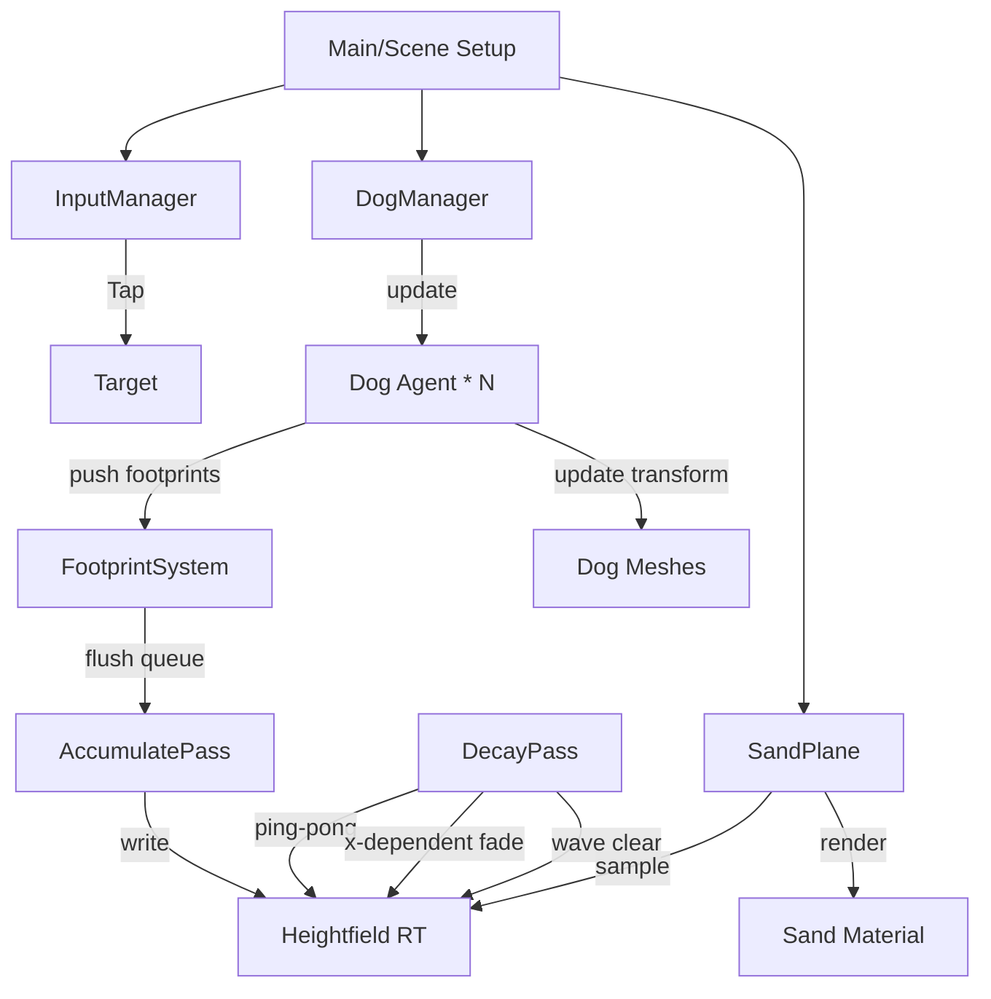

> **役割分担**: 設計 = ZhuPiAI GLM-5.2 / 実装 = codex GPT-5.5 / 統括・橋渡し = Claude
>
> ## 統括メモ (Claude) — Phase 1 で行った設計⇄実装の調整
> - **リングバッファは 100 を採用**（ユーザー明示指示）。GLM 提案の「蓄積RT全面刷新（リングバッファ廃止）」は
>   既存の実績ある compose パイプラインを壊す高リスク案のため Phase 1 では不採用とし、`MAX_FOOTPRINTS 15→100` の
>   最小変更に留めた。蓄積RT方式は本書 §6 Phase 2/3 の最適化として保持。
> - **既存ファイルパスに合わせて再マッピング**（GLM の `src/systems/` 等は実在せず、実体は `src/footprints/`・`src/sand/`）。
> - **足跡は犬の歩行駆動へ**。`FootprintSystem.addFootprint()` を新設し、SandPlane/シェーダーは無改変で互換維持。
> - **x依存（右ほど残る/つきやすい）** は既存の age 減衰モデルに per-print の `formability(x)` と `decayBias(x)` を組込み実装。
> - **肉球は 50% 縮小**（`baseScale = size*0.25`）。**犬は真上テクスチャ**を手続き生成（GPT-5.5 担当）。
> - **未実装/既知リスク**: (a) 砂の「左→右 濡れバンドのグラデ」シェーダー描画は Phase 1 では見送り
>   （砂全体をグレー/タウプ＋湿りへ調整済み。足跡側の x 依存は実装済み）。
>   (b) `MAX_FOOTPRINTS=100` は compose の uniform 配列（`uFootA[100]/uFootB[100]`）を使うため、
>   ローエンドモバイルの fragment uniform 上限に当たる可能性。デスクトップ/主要端末では問題なし。恒久対策は Phase 2 蓄積RT。
>
> ---

# 設計書: 砂浜で犬を走らせるアプリ (sand-footprint-sim 発展版)

## 1. 全体アーキテクチャ図解

### モジュール構成


### 新規/変更ファイル一覧
- **変更**: `src/sandParams.ts` - パラメータ追加・調整
- **変更**: `src/systems/FootprintSystem.ts` - リングバッファから蓄積キューへ
- **変更**: `src/systems/SandPlane.ts` - 蓄積RTパイプラインへ移行、DecayPass追加
- **新規**: `src/systems/DogManager.ts` - 複数犬エージェント管理
- **新規**: `src/agents/Dog.ts` - 犬エージェント（ステアリング・歩行・足跡生成）
- **新規**: `src/systems/TargetManager.ts` - タップターゲット管理
- **新規**: `src/textures/generateDogTopTexture.ts` - トップダウン犬テクスチャ生成契約
- **変更**: `src/main.ts` - ポインタドラッグ廃止、タップターゲット配置へ

---

## 2. 各新規/変更モジュールのAPIスケッチ

### `src/sandParams.ts`
```typescript
export const sandParams = {
  // 既存...
  heightfieldResolution: 512,    // 変更: 1024→512 (モバイル30FPS確保)
  baseFootprintScale: 0.5,       // 変更: 50%縮小
  
  // 新規: x依存の残りやすさ
  xLeft: -8.0,
  xRight: 8.0,
  formabilityLo: 0.2,            // 左端の付きやすさ(浅い)
  formabilityHi: 1.0,            // 右端の付きやすさ(深い)
  persistenceLo: 0.92,           // 左端の残りやすさ(速く消える)
  persistenceHi: 0.998,          // 右端の残りやすさ(残る)
  
  // 新規: 砂色・見た目
  sandTone: 0.15,                // 変更: グレー寄りへ
  moisture: 0.5,                 // 変更: 湿らせる
  wetBandCenter: 0.6,            // 0=左, 1=右 の位置
  wetBandWidth: 0.3,
  wetBandDarken: 0.4,
  bodyWeight: 0.6,
  footprintDepth: 0.015,
  darkeningStrength: 0.2,
  rimHeight: 0.008,
  
  // 新規: 犬エージェント
  dogCount: 5,
  dogWorldSize: 0.8,
  dogMaxSpeed: 2.5,
  dogArriveRadius: 0.5,
  dogSepRadius: 0.7,
  dogStride: 0.35,
};
```

### `src/systems/FootprintSystem.ts`
```typescript
export interface Footprint {
  pos: THREE.Vector2;      // (x, z)
  yaw: number;
  scale: number;           // baseFootprintScale * formability(x)
  side: number;            // 0=FL, 1=HR, 2=FR, 3=HL
  seed: number;
  depthScale: number;      // x依存
  weight: number;
}

export class FootprintSystem {
  // 固定長キュー（毎フレームnew禁止）
  private queue: Footprint[];
  private queueCount: number = 0;
  private stampMesh: THREE.InstancedMesh;  // 蓄積RT描画用
  
  constructor(maxQueued: number);
  
  push(fp: Footprint): void;
  flushToRT(renderer: THREE.Renderer, rt: THREE.RenderTarget, scene: THREE.Scene, camera: THREE.Camera): void;
  clearQueue(): void;
}
```

### `src/systems/SandPlane.ts`
```typescript
export class SandPlane {
  private accumRT_A: THREE.WebGLRenderTarget;  // HalfFloat
  private accumRT_B: THREE.WebGLRenderTarget;
  private decayScene: THREE.Scene;
  private decayMesh: THREE.Mesh;  // フルスクリーン
  private stampScene: THREE.Scene;
  
  constructor(footprintSystem: FootprintSystem);
  
  // 毎フレーム呼ぶ
  updateDecay(renderer: THREE.Renderer, dt: number, waveFrontX: number): void;
  render(renderer: THREE.Renderer, camera: THREE.Camera): void;
}
```

### `src/agents/Dog.ts`
```typescript
export class Dog {
  pos: THREE.Vector2;
  vel: THREE.Vector2;
  yaw: number;
  state: 'idle' | 'wander' | 'seek' | 'arrive';
  
  private gaitPhase: number = 0;       // 0-3 (FL,HR,FR,HL)
  private distSinceStep: number = 0;
  private mesh: THREE.Mesh;
  private _tmpV1: THREE.Vector2;       // 再利用
  private _tmpV2: THREE.Vector2;
  
  constructor(seed: number, params: DogParams);
  
  update(dt: number, target: THREE.Vector2 | null, neighbors: Dog[], outFootprints: Footprint[]): void;
  getMesh(): THREE.Mesh;
}
```

### `src/systems/DogManager.ts`
```typescript
export class DogManager {
  private dogs: Dog[];
  private footprintBuffer: Footprint[];  // 固定長
  
  constructor(count: number, footprintSystem: FootprintSystem);
  update(dt: number, target: THREE.Vector2 | null): void;
  getMeshes(): THREE.Mesh[];
}
```

### `src/systems/TargetManager.ts`
```typescript
export class TargetManager {
  private target: THREE.Vector2 | null;
  private mesh: THREE.Mesh;
  private bornTime: number;
  
  setTarget(pos: THREE.Vector2): void;
  getTarget(): THREE.Vector2 | null;
  update(dt: number, dogPositions: THREE.Vector2[]): void;  // 到着で消滅
  getMesh(): THREE.Mesh;
}
```

### `src/textures/generateDogTopTexture.ts`
```typescript
export interface DogTextureOptions {
  size: number;           // 例: 256
  seed: number;
  bodyColor: THREE.ColorRepresentation;
  bellyColor: THREE.ColorRepresentation;
}

/**
 * トップダウン犬テクスチャを生成する。
 * 向き規約: テクスチャの +V（上）が犬の鼻先（進行方向）。
 * アンカー: テクスチャ中心 (0.5, 0.5) が犬の中心。
 * 出力: THREE.Texture (RGBA, 透明背景)
 * 脚アニメ: Phase 1では不要。静止画。
 */
export function generateDogTopTexture(opts: DogTextureOptions): THREE.Texture;
```

---

## 3. 設計判断 A〜H

### A. 容量と持続: 蓄積RT方式への移行

**判断: 蓄積RT方式を採用。リングバッファ方式は廃止。**

理由:
- 100個の足跡を毎回1024^2 RTに再ベイクするのはモバイルで重い。
- 蓄積RT方式なら、1フレームに追加される足跡（最大5匹×2脚=10個程度）だけを描画すればよい。

**方式:**
1. **蓄積RT**: `HalfFloat` (RGBA16F) の512×512ピンポンバッファ（A/B）。
2. **AccumulatePass**: `FootprintSystem` のキュー（数個）を `InstancedMesh` で蓄積RTに加算合成。スタンプテクスチャのRチャンネル（深さ）を加算。
3. **DecayPass**: 毎フレーム、蓄積RTをピンポンし、x依存の減衰とWashWaveクリアを行う。

**DecayPassシェーダー（TSL）:**
```glsl
// ピンポン: A→B または B→A
uniform sampler2D tPrev;
uniform float uDecayLo;   // sandParams.persistenceLo
uniform float uDecayHi;   // sandParams.persistenceHi
uniform float uXLeft;
uniform float uXRight;
uniform float uWaveFrontX;
varying vec2 vUv;

void main() {
    vec4 prev = texture2D(tPrev, vUv);
    
    // worldXをUVから逆算 (uXLeft..uXRight → 0..1)
    float worldX = mix(uXLeft, uXRight, vUv.x);
    float t = smoothstep(uXLeft, uXRight, worldX);
    float decay = mix(uDecayLo, uDecayHi, t);
    
    float height = prev.r * decay;
    
    // WashWave: 波frontより左（陸側）はクリア
    // 波は右(海)から左(陸)へ進む。frontより左=洗われた
    if (worldX < uWaveFrontX) {
        height = 0.0;
    }
    
    gl_FragColor = vec4(height, prev.gba);
}
```

**WebGL2フォールバック互換:**
- `InstancedMesh` はWebGL2でサポート済み。
- `HalfFloat` RTは `EXT_color_buffer_float` でサポート。フォールバック時は `UnsignedByte` に落とす（精度は劣るが動作する）。
- uniform配列を使わないため、uniform上限の問題なし。

**WashWave互換:**
- `waveFrontX` をDecayPassに渡す。波が通過した領域（`worldX < waveFrontX`）の高さを0にクリア。
- 波リセット時は蓄積RT全体をクリア。

---

### B. 複数犬エージェント

**推奨N=5匹。**

**状態遷移:**
- `idle`: targetなし。wanderへ遷移。
- `wander`: ランダムに歩き回る。target配置でseekへ。
- `seek`: targetへ向かう。到着半径内でarriveへ。
- `arrive`: 減速して停止。target消滅でidleへ。

**ステアリング（毎フレームnew禁止、メンバーVector2再利用）:**
```typescript
update(dt, target, neighbors, outFootprints) {
    const desired = this._tmpV1.set(0, 0);
    
    // Seek + Arrive
    if (target) {
        desired.subVectors(target, this.pos);
        const dist = desired.length();
        if (dist < sandParams.dogArriveRadius) {
            this.state = 'arrive';
            desired.multiplyScalar(-0.5); // ブレーキ
        } else {
            this.state = 'seek';
            desired.normalize().multiplyScalar(sandParams.dogMaxSpeed);
        }
    } else {
        // Wander: 現在の向きにノイズ
        this.state = 'wander';
        desired.set(Math.cos(this.yaw), Math.sin(this.yaw))
               .multiplyScalar(sandParams.dogMaxSpeed * 0.5);
    }
    
    // Separation
    const sep = this._tmpV2.set(0, 0);
    for (const n of neighbors) {
        if (n === this) continue;
        sep.subVectors(this.pos, n.pos);
        const d = sep.length();
        if (d < sandParams.dogSepRadius && d > 1e-4) {
            sep.normalize().multiplyScalar((sandParams.dogSepRadius - d) / sandParams.dogSepRadius);
        }
    }
    
    // 加速度適用
    this.vel.add(desired.multiplyScalar(dt * 2.0))
            .add(sep.multiplyScalar(dt * 3.0));
    
    // 速度制限
    const speed = this.vel.length();
    if (speed > sandParams.dogMaxSpeed) {
        this.vel.multiplyScalar(sandParams.dogMaxSpeed / speed);
    }
    if (speed < 0.01) this.vel.set(0, 0);
    
    // 位置更新
    this.pos.addScaledVector(this.vel, dt);
    
    // 向き更新
    if (speed > 0.05) {
        this.yaw = Math.atan2(this.vel.x, this.vel.y); // +Y=鼻先規約
    }
    
    // 足跡生成
    this.distSinceStep += speed * dt;
    if (this.distSinceStep > sandParams.dogStride) {
        this.distSinceStep = 0;
        this.emitFootprint(outFootprints);
    }
    
    // メッシュ更新
    this.mesh.position.set(this.pos.x, 0.01, this.pos.y);
    this.mesh.rotation.y = -this.yaw; // Three.js Y軸回転
}
```

---

### C. 足跡駆動の移行

**PointerTrail廃止。各犬が歩行で足跡生成。**

**歩容ロジック（既存流用）:**
- GAIT順序: `[FL, HR, FR, HL]` (対角歩容)
- 各犬が `gaitPhase` (0-3) を持つ。
- `stride` 距離歩くごとに `gaitPhase` を進め、対応する脚の足跡を生成。

**足跡生成（Dog.emitFootprint）:**
```typescript
private emitFootprint(out: Footprint[]) {
    const GAIT = [
        { side: 0, offset: new THREE.Vector2(-0.12, 0.15) },  // FL
        { side: 1, offset: new THREE.Vector2(0.12, -0.15) },  // HR
        { side: 2, offset: new THREE.Vector2(0.12, 0.15) },   // FR
        { side: 3, offset: new THREE.Vector2(-0.12, -0.15) }, // HL
    ];
    
    const g = GAIT[this.gaitPhase];
    this.gaitPhase = (this.gaitPhase + 1) % 4;
    
    // ローカルオフセットをワールド回転
    const cos = Math.cos(this.yaw);
    const sin = Math.sin(this.yaw);
    const wx = this.pos.x + g.offset.x * cos - g.offset.y * sin;
    const wz = this.pos.y + g.offset.x * sin + g.offset.y * cos;
    
    // x依存のformability
    const t = THREE.MathUtils.smoothstep(wx, sandParams.xLeft, sandParams.xRight);
    const formability = THREE.MathUtils.lerp(sandParams.formabilityLo, sandParams.formabilityHi, t);
    
    out.push({
        pos: new THREE.Vector2(wx, wz),  // ※実際は再利用オブジェクト
        yaw: this.yaw,
        scale: sandParams.baseFootprintScale * formability,
        side: g.side,
        seed: this.seed + this.gaitPhase,
        depthScale: formability,
        weight: sandParams.bodyWeight,
    });
}
```

**注意:** `out.push` でnewしないよう、`DogManager` がプールから貸出。

---

### D. インタラクション

**ドラッグ廃止。タップ専用。**

- タップ → `TargetManager.setTarget(worldPos)` → ターゲットメッシュ表示 → 全犬が `seek`。
- ターゲット消滅条件:
  1. いずれかの犬が到着半径内に接近 → 消滅。
  2. 5秒経過 → 消滅。
- ターゲット見た目: 小さな赤い円（プロシージャル `CircleGeometry` + 単色マテリアル）。

---

### E. x依存の残りやすさ・つきやすさ

**formability(x)（つきやすさ）:**
```
t = smoothstep(xLeft, xRight, worldX)
formability = mix(0.2, 1.0, t)
```
- 左端: 足跡が浅く（20%）、付きにくい。
- 右端: 足跡が深く（100%）、付きやすい。
- 適用: `scale *= formability`, `depthScale *= formability`

**persistence(x)（残りやすさ）:**
```
t = smoothstep(xLeft, xRight, worldX)
persistence = mix(0.92, 0.998, t)
```
- 左端: 毎フレーム8%減衰（速く消える）。
- 右端: 毎フレーム0.2%減衰（残る）。
- 適用: DecayPass内で `height *= persistence`

**world-x目安:**
- `visibleWorldHeight = 12`、アスペクト比16:9想定で `visibleWorldWidth ≈ 21.3`。
- `xLeft = -10.0`, `xRight = +10.0`（画面端より少し内側）。

---

### F. 50%縮小

**対象定数:**
- `sandParams.baseFootprintScale`: `1.0` → `0.5`
- これにより全足跡のスタンプサイズが半分になる。
- `dogStride` も相対的に小さく（`0.5` → `0.35`）して足跡間隔を詰める。

---

### G. さりげない見た目 & 砂色

**パラメータ推奨値:**
| パラメータ | 旧値 | 新値 | 理由 |
|-----------|------|------|------|
| `bodyWeight` | 1.0 | 0.6 | 軽く浅く |
| `footprintDepth` | 0.03 | 0.015 | 浅く |
| `darkeningStrength` | 0.5 | 0.2 | 薄く |
| `rimHeight` | 0.02 | 0.008 | 控えめに |
| `moisture` | 0.06 | 0.5 | 湿らせる |
| `sandTone` | 0.5 | 0.15 | グレー寄り |

**濡れバンド（中央〜右の濃いバンド）:**
既存shaderにTSLで追加可能。GLSL二重化不要。

```typescript
// SandPlaneのレンダーマテリアルに追加
const wetBand = tslFn(([uvX]) => {
    const center = uniform(sandParams.wetBandCenter);
    const width = uniform(sandParams.wetBandWidth);
    const darken = uniform(sandParams.wetBandDarken);
    const dist = abs(uvX.sub(center));
    const band = smoothstep(width, 0.0, dist);
    return band.mul(darken);
});
```

---

### H. トップダウン犬の描画

**テクスチャ契約:**
- 関数: `generateDogTopTexture(opts: DogTextureOptions): THREE.Texture`
- 引数: `{ size: 256, seed: number, bodyColor: string, bellyColor: string }`
- 出力: `THREE.Texture` (RGBA, 透明背景)
- 向き: テクスチャ +V（上）= 鼻先（進行方向）
- アンカー: 中心 (0.5, 0.5)
- ワールドサイズ: `sandParams.dogWorldSize = 0.8`
- 脚アニメ: Phase 1では不要。静止画。

**メッシュ:**
- `THREE.PlaneGeometry(dogWorldSize, dogWorldSize)`
- `THREE.MeshBasicMaterial({ map: texture, transparent: true, depthWrite: false })`
- `rotation.x = -Math.PI / 2`（XZ平面に倒す）
- `rotation.y = -yaw`（向き変更、+Y=鼻先規約）

---

## 4. sandParamsへ追加するパラメータ一覧

| 名前 | 意味 | default | 範囲 |
|------|------|---------|------|
| `heightfieldResolution` | 蓄積RT解像度 | 512 | 256-1024 |
| `xLeft` | 左端のworld-x | -10.0 | -20..0 |
| `xRight` | 右端のworld-x | 10.0 | 0..20 |
| `formabilityLo` | 左端の付きやすさ | 0.2 | 0..1 |
| `formabilityHi` | 右端の付きやすさ | 1.0 | 0..1 |
| `persistenceLo` | 左端の残りやすさ | 0.92 | 0.8..1 |
| `persistenceHi` | 右端の残りやすさ | 0.998 | 0.9..1 |
| `wetBandCenter` | 濡れバンド中心(UV.x) | 0.6 | 0..1 |
| `wetBandWidth` | 濡れバンド幅 | 0.3 | 0..1 |
| `wetBandDarken` | 濡れバンド暗さ | 0.4 | 0..1 |
| `dogCount` | 犬の数 | 5 | 1-10 |
| `dogWorldSize` | 犬のワールドサイズ | 0.8 | 0.5-1.5 |
| `dogMaxSpeed` | 犬の最大速度 | 2.5 | 1-5 |
| `dogArriveRadius` | 到着半径 | 0.5 | 0.2-2 |
| `dogSepRadius` | 分離半径 | 0.7 | 0.3-2 |
| `dogStride` | 歩幅 | 0.35 | 0.2-1 |

---

## 5. 受け入れ条件

1. **複数犬が砂浜に配置され、自律的に動く**
   - 5匹の犬がidle/wanderで散歩する。
2. **タップでターゲット配置→犬が集まる**
   - タップ地点にターゲットが出現し、全犬がseek状態で向かう。
   - 到着でターゲット消滅、犬はidleに戻る。
3. **足跡が50%縮小されている**
   - 既存の足跡サイズと視覚的に比較して半分。
4. **右ほど足跡が残り、左ほど速く消える**
   - 右端の足跡が数秒残る。左端の足跡が1-2秒で消える。
5. **足跡がさりげない**
   - 参考写真のように薄く浅くローコントラスト。
6. **砂浜の色がグレー〜タウプ**
   - 金色すぎない。中央〜右に濡れバンド。
7. **犬が真上から見える**
   - トップダウン犬テクスチャが表示される。
8. **iPhone Safari 30FPS**
   - 512^2 RT蓄積方式で安定動作。

---

## 6. 実装フェーズ分割

### Phase 1（GPT-5.5 1パス実装）: 最小動作

**対象:**
- `sandParams.ts` 更新（新規パラメータ追加、既存値変更）
- `FootprintSystem.ts` リングバッファ→固定長キュー+InstancedMesh
- `SandPlane.ts` 蓄積RTパイプライン移行（AccumulatePass + DecayPass）
- `Dog.ts` 新規（ステアリング、歩行、足跡生成）
- `DogManager.ts` 新規
- `TargetManager.ts` 新規
- `generateDogTopTexture.ts` 新規（契約に従い実装）
- `main.ts` ドラッグ廃止、タップターゲット配置へ

**動作確認:**
1. アプリ起動 → 5匹の犬が砂浜に配置されwander
2. タップ → ターゲット出現 → 犬が集まる → 到着でターゲット消滅
3. 足跡が小さく薄く残る
4. 右側の足跡が左側より長く残る
5. 砂浜がグレー寄り、中央〜右に濡れバンド
6. 犬が真上から見える

### Phase 2（将来）: 拡張
- 脚アニメーション（歩行位相でテクスチャ切替 or シェーダー変形）
- ターゲットバリエーション（ルアー、ボール、おやつで犬の速度変化）
- 犬種バリエーション（サイズ・色・体型）
- WashWaveのビジュアル強化（波の描画自体）

### Phase 3（将来）: 最適化
- ダーティ領域のみDecayPass（必要領域のみ更新）
- LOD（遠くの犬を簡略化）
- WebGPU専用最適化（ComputeShaderで足跡蓄積）